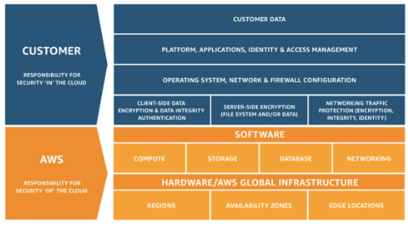
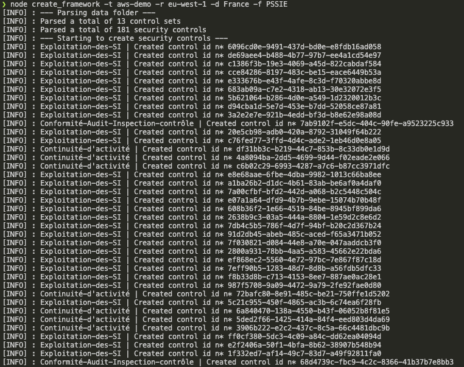
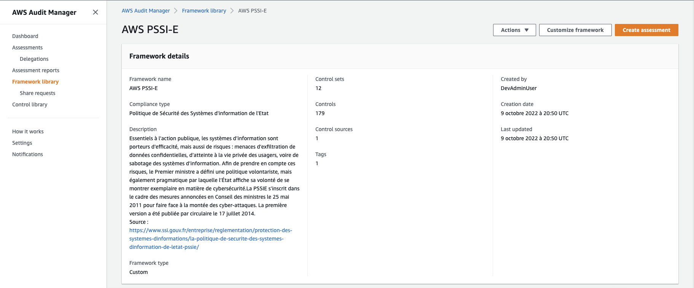
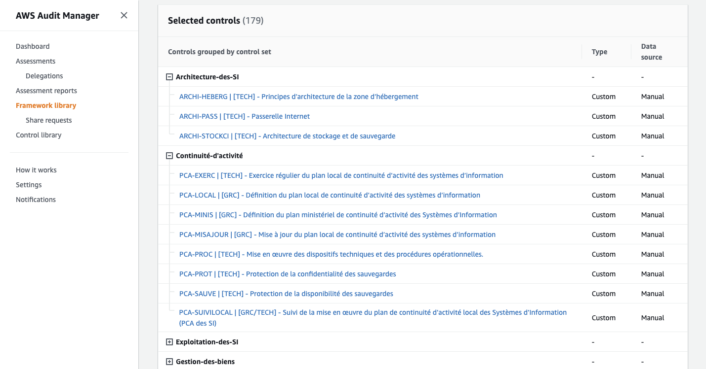
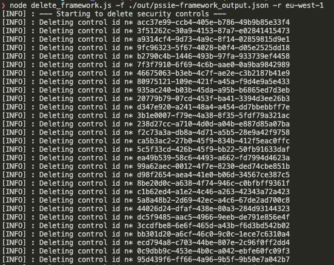

# Politique de Sécurité des Systèmes d'Information de l'Etat

Le périmètre de la Politique des Systèmes d'Information de l'Etat (PSSI-E) couvrent l'ensemble des sujets devant être considérés afin d'établir une posture de sécurité informatique satisfaisante. Le document établi un ensemble d'exigences de sécurité techniques, juridiques et organisationelles déclinés selon les 13 sections et 34 objectifs composant le document.

La solution proposée permet de guider les entités dans la réalisation d'un audit de conformité via l'utilisation d'AWS Audit Manager et de consolider automatiquement l'ensemble des justifications et documents devant être disponibles. L'audit de conformité peut être conduit vis à vis d'un système d'information déployé sur AWS où sur un autre environnement. Des recommandations de sécurité sont faîtes afin de faciliter les évaluations vis-à-vis des déploiements ayant choisit AWS.

# ANSSI : Politique de Sécurité des Systèmes d'Information de l'Etat

La PSSIE fixe les règles de protection applicables aux systèmes d’information de l’État.

Essentiels à l’action publique, les systèmes d’information sont porteurs d’efficacité, mais aussi de risques : menaces d’exfiltration de données confidentielles, d’atteinte à la vie privée des usagers, voire de sabotage des systèmes d’information. Afin de prendre en compte ces risques, le Premier ministre a défini une politique volontariste, mais également pragmatique par laquelle l’État affiche sa volonté de se montrer exemplaire en matière de cybersécurité.
La PSSIE s’inscrit dans le cadre des mesures annoncées en Conseil des ministres le 25 mai 2011 pour faire face à la montée des cyber-attaques. La première version a été publiée par circulaire le 17 juillet 2014.

Source : <a href=" https://www.ssi.gouv.fr/entreprise/reglementation/protection-des-systemes-dinformations/la-politique-de-securite-des-systemes-dinformation-de-letat-pssie/">ANSSI</a>

Source : <a href=" https://www.ssi.gouv.fr/uploads/IMG/pdf/pssie_anssi.pdf">ANSSI</a>

# A propos de la Politique de Sécurité des Systèmes d'Information de l'Etat et d'AWS

Les 13 sections, 34 objectifs et 181 contrôles de sécurité sont disponibles et implémentés. Ces derniers viennent définir un ensemble d'exigences de sécurité auxquelles les entités comprises dans le champs d'application doivent se conformer.

Si le périmètre de la PSSI-E est bien plus large et a une vocation plus globale que la sécurité informatique appliquée aux systèmes d'information déployé dans un environnement cloud : L'utilisation des servies d'AWS vient rendre l'atteinte des différents objectifs plus plus simple et permet d'être plus ambitieux dans les implémentations des contrôles de sécurité.

Ainsi la possibilité qu'offre le cloud de disposer d'environnements standardisés, pouvant faire l'objet de multiples cloisonnements, facilement auditables en continue, généralisant l'implémentation du chiffrement et des mécanismes de surveillance, aux automatismes de back-up et de récupération natifs apparaît comme un avantage par rapport à des datacenters traditionnels : Notemment dans les domaines du maintien en condition de sécurité, de la réponse à incident, de la continuité d'activité, de la gestion des logs et des traces, de la gestion des identités et des accès.

Pour les organisations qui décident de construire sur AWS, nous recommandons l'élaboration d'une PSSI cloud ainsi que la formalisation des guides et procédures de sécurité pouvant être lié à l'utilisation des différentes services.

## Modèle de responsabilité partagé

Conformément au <a href="https://aws.amazon.com/fr/compliance/shared-responsibility-model/?nc1=h_ls">modèle de responsabilité partagé</a> la sécurité et la conformité d'un système d'information dans le cloud est répartie entre AWS et le client. Aussi l'atteinte des exigences de sécurité passe par le déploiement par les clients des contrôles (techniques, organisationnelles et contractuelles) de sécurité requit par le référentiel. Lors de la réalisation d'un audit les rapports de sécurité concernant AWS peuvent être téléchargé directement depuis <a href="https://aws.amazon.com/fr/artifact/">AWS Artifact</a>.

## Travailler avec AWS Audit Manager

Une fois le cadre d'évaluation personnalisé déployé. La gestion du rapport et des audits se fait depuis la section <a href="https://docs.aws.amazon.com/audit-manager/latest/userguide/assessments.html">"Assessments"</a> d'AWS Audit Manager.

## Liens de référence

- ANSSI, Politique de sécurité des systèmes d'information de l'état (PSSI-E) : https://www.ssi.gouv.fr/entreprise/reglementation/protection-des-systemes-dinformations/la-politique-de-securite-des-systemes-dinformation-de-letat-pssie/
- ANSSI,PSSIE : https://www.ssi.gouv.fr/uploads/IMG/pdf/pssie_anssi.pdf
- ANSSI, Référentiel général de sécurité (RGS) : https://www.ssi.gouv.fr/entreprise/reglementation/confiance-numerique/le-referentiel-general-de-securite-rgs/
- Legifrance, circulaire n*5725 du 17 juillet 2014 : https://www.legifrance.gouv.fr/circulaire/id/38641
- AWS Artifact : https://docs.aws.amazon.com/artifact/latest/ug/what-is-aws-artifact.html
- AWS Audit Manager : https://docs.aws.amazon.com/audit-manager/latest/userguide/what-is.html

## Captures d'écran

