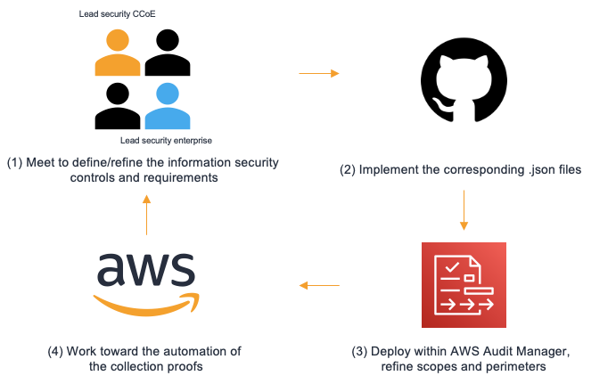

# AWS Audit Manager custom security frameworks
:gb: In addition to providing a solution to create and manage custom security controls and frameworks this repository provide an integration of the security frameworks of France within <a href="https://aws.amazon.com/audit-manager/">AWS Audit Manager</a> in order to simplify security assessments. 

:fr: Le répertoire présent, en plus de proposer une solution afin de créer et de gérer des référentiels de sécurité personnalisés, propose une intégration des cadres de sécurité Français dans <a href="https://aws.amazon.com/audit-manager/">AWS Audit Manager</a> afin de simplifier les audits de sécurité.

## Conformité à l'échelle / Compliance at scale



## Référentiels de sécurité supportés / Supported security frameworks
- :gb: Hébergeur de données de santé ([HDS](./data/HDS/readme.md))
- :fr: Politique de sécurité des systèmes d'information de l'état ([PSSI-E](./data/PSSIE/readme.md))

## Architecture principles

The solution is structured on the following folders and files :
- ***/model*** : This folder contains the data format that is used as a parameter when calling AWS Audit Manager via the SDK.

The data model can be used in order to quickly create a custom controls that can be then integrated in a custom framework that can then be deployed using the code of this repository.

- ***/data*** : This folder contains the security controls of the supported assessment frameworks in a format compatible with AWS Audit Manager.

Folders that contains controls that must be parsed and grouped within the same control set during the creation of a custom frameworks must end with an identifying sufffixe. By default the suffix is set to ```_control_set```

- ***/out*** : This folder contains the result of the deployment of a custom assessment framework written in the file ```<directory>-<framework>-framework_output.json```. This file repertories the information associated with a deployment for documentation and deletation purposes.

- ***/src*** : This folder contains the sources required by the solution.

- ***create_framework.js*** : This is the entrypoint to deploy a custom assessment framework contained in the folder /data.

- ***delete_framework.js*** : This is the entrypoint to delete a previously deployed custom assessment framework.

## Before deploying

- (>=v16.8.0) Have a compatible node.js version.
- Finish the set up of <a href="https://docs.aws.amazon.com/audit-manager/latest/userguide/setting-up.html"> AWS Audit Manager.</a>
- Have AWS security key (AK/SK) with permission to perform operations on AWS Audit Manager.

(Optional) From AWS Cloudshell
- Clone the repository ```git clone https://gitlab.aws.dev/guilneau/france-audit-manager.git```
- Install the required dependencies : ```npm install```.
- Deploy the security frameworks in your account.
- Export the folder "./out" to S3, they will facilitate the deletion of the created resources.

## How to use

1. To create a custom framework : 
```node create_framework -t <tag> -r <aws-region> -d <directory> -f <framework>```

Ex : ```node create_framework -t aws-demo -r eu-west-1 -d France -f HDS``` will deploy the security requirements within the "HDS" folder as a custom assessment framework within the eu-west-1 region. (Dublin)

Note : ```-d <dossiser>``` and ```-f <framework>``` are "case sensitive".

Uppon successful completion : the file ```hds-framework_output.json``` is created in the folder /out.

2. To delete a custom framework ```node delete_framework -f <file>```

Ex : ```node delete_framework -f ./out/hds-framework_output.json``` will delete the security controls and the custom assessment framework generated during the creation process.

Uppon successful completion : the file ```hds-framework_output.json``` is deleted.

## Creating a custom framework

To create a custom assessment framework using this tool : 

1. From the folder ***/data*** create a folder < custom > that will be serve as the root of your custom assessment framework.

    a. Create a ```custom_framework.json``` file and fill the the requested fields.

    b. (optional) Create a ```readme.md``` to document your custom assessment framework.

2. In the folder < custom >, create as many folders as necessary <a href="https://docs.aws.amazon.com/audit-manager/latest/APIReference/API_ControlSet.html">control set</a> 

    a. By default the name of your folder must be suffixed by "_control_set" and should follow : < name of the control set >_control_set

3. In each control set folder "< name of the control set >_control_set" add the file that will be the security controls that must be respected.

    a. Create a file in a json format that must be compliant with the following model : [modèle proposé](./model/sec_control-model.json).

    b. (optional) Read the model documentation : <a href="https://docs.aws.amazon.com/audit-manager/latest/APIReference/API_Control.html">documentation</a> from AWS Audit Manager.

4. Create your custom assessment framework with the appropriate command.

## Notes
- By default the security controls are classified as per the business entity that should own the satisfaction of the requirements. Here are the meaning of the used acronyms.

Ex : ANS | **[GRC]** - Certification audit reports available uppon request

<table style="width:100%;">
    <thead>
        <tr>
            <th colspan="2" style="text-align:center">Nomenclatures</th>
        </tr>
    </thead>
    <tbody >
        <tr>
            <td style="text-align:center">Key</td>
            <td style="text-align:center">Signification</td>
        </tr>
        <tr>
            <td>GRC</td>
            <td>Governance Risk Compliance - The security controls is referring to the satisfaction of procedures and process that are owned by the GRC team.</td>
        </tr>
        <tr>
            <td>TECH</td>
            <td>Technical - The security controls is referring to measurable and quantifiable technical implementation that the engineering or product team own.</td>
        </tr>
        <tr>
            <td>LEGAL</td>
            <td>Legal & Contractual - The security controls is referring to clauses and obligations are legally or contractually tying.</td>
        </tr>
    </tbody>
</table>

## Security

See [CONTRIBUTING](CONTRIBUTING.md) for more information.

## License

This library is licensed under the MIT-0 License. See the LICENSE file.
