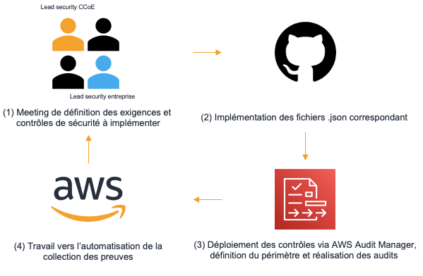

# AWS Audit Manager custom security frameworks
:gb: In addition to providing a solution to create and manage custom security controls and frameworks this repository provide an integration of the security frameworks of France within <a href="https://aws.amazon.com/audit-manager/">AWS Audit Manager</a> in order to simplify security assessments. 

:fr: Le répertoire présent, en plus de proposer une solution afin de créer et de gérer des référentiels de sécurité personnalisés, propose une intégration des cadres de sécurité Français dans <a href="https://aws.amazon.com/audit-manager/">AWS Audit Manager</a> afin de simplifier les audits de sécurité.

[Readme in english](./readme-en.md)

## Conformité à l'échelle / Compliance at scale



## Référentiels de sécurité supportés / Supported security frameworks
- :gb: Hébergeur de données de santé ([HDS](./data/HDS/readme.md))
- :fr: Politique de sécurité des systèmes d'information de l'état ([PSSI-E](./data/PSSIE/readme.md))

## Principes d'architecture

La solution proposée est structurée autour des dossiers et fichiers :
- ***/model*** : Le dossier contient le format de donnée devant être utilisé comme argument dans les appels vers AWS Audit Manager et via le SDK. 

Elle peut être utilisée afin de rapidement créer un cadre d'audit personnalisé qui pourra ensuite être déployé en utilisant le code proposé dans ce répertoire.

- ***/data*** : Le dossier contient contient les exigences de sécurités des cadres français dans un format compatible avec AWS Audit Manager.

Les dossiers devant être parsés et retenus pour la création d'un cadre d'évaluation personnalisé doivent avoir un suffix permettant de les identifier. Par défaut le suffix est configuré sur ```_control_set```.

- ***/out*** : Le dossier contient le résultat du déploiement du cadre d'évaluation (framework), le fichier ```<framework>-framework_output.json```. Ce fichier répertorie les informations liées au déploiement à des fins de documentation, maintenance et suppression.

- ***/src*** : Le dossier contient les sources nécessaires au fonctionnement de la solution proposées.

- ***create_framework.js*** : Point d'entré permettant de déployer un cadre d'évaluation contenu dans le dossier /data.

- ***delete_framework.js*** : Point d'entré permettant de supprimer un cadre d'évaluation précédemment déployé.

## Avant le déploiement

- (>=v16.8.0) Disposer d'une version de node.js compatible avec le projet.
- Finir l'initialisation <a href="https://docs.aws.amazon.com/audit-manager/latest/userguide/setting-up.html"> d'AWS Audit Manager.</a>
- Disposer de clefs de sécurité AWS (AK/SK) disposant des permissions (IAM Policy) nécessaire pour intéragir avec AWS Audit Manager.

(Optionel) Depuis AWS Cloudshell
- Cloner le répertoire ```git clone https://gitlab.aws.dev/guilneau/france-audit-manager.git```
- Installer les dépendances requises : ```npm install```
- Déployer les cadres de sécurité dans les environnements AWS
- Exporter le dossier "./out" vers S3, les fichiers permettront de faciliter la suppression des ressources créées.

## Utilisation

1. Création d'un cadre d'évaluation personnalisé : 
```node create_framework -t <tag> -r <aws-region> -d <directory> -f <framework>```

Ex : ```node create_framework -t aws-demo -r eu-west-1 -d France -f HDS``` déploit le référentiel d'exigences associé à "HDS" en tant que cadre d'évaluation personnalisé dans la région d'irlande en taggant l'ensemble des ressources 'aws-demo'.

Note : Les options ```-d <directory>``` et ```-f <framework>``` sont "case sensitive".

Le fichier ```hds-framework_output.json``` est généré dans le dossier /out.

2. Suppression d'un cadre d'évaluation personnalisé : ```node delete_framework -f <file>```

Ex : ```node delete_framework -f ./out/hds-framework_output.json``` supprime l'ensemble des contrôles de sécurité ainsi que le cadre d'évaluation lié au déploiement associé au référentiel d'exigences "HDS". 

Le fichier ```hds-framework_output.json``` est supprimé.

## Création d'un cadre d'évaluation personnalisé.

Afin de créer un cadre d'évaluation personnalisé :

1. Depuis le dossier ***/data*** créer un dossier < custom > qui servira de racine pour la création des "control_set".

    a. Dans ce dossier créer un fichier ```custom_framework.json``` et remplir les champs.

    b. (optional) Créer un fichier ```readme.md``` afin de documenter le cadre d'évaluation personnalisé créé.

2. Dans le dossier < custom >, créer autant de dossier que de <a href="https://docs.aws.amazon.com/audit-manager/latest/APIReference/API_ControlSet.html">control set</a> nécessaire.

    a. La nomenclature du dossier doit suivre : < Nom du control set >_control_set

3. Peupler chaque control dossier < Nom du control set >_control_set en ajoutant les fichiers précisant les contrôles de sécurité devant être respecté.

    a. Créer un fichier au format json suivant le [modèle proposé](./model/sec_control-model.json) et le compléter.

    b. (optional) Lire le modèle depuis la <a href="https://docs.aws.amazon.com/audit-manager/latest/APIReference/API_Control.html">documentation</a> d'AWS Audit Manager.

4. Créer le cadre d'évaluation en se rapportant à la section #Utilisation

## Notes
- Les contrôles de sécurité sont classés suivant des catégories afin de faciliter l'identification des principales parties prenantes dans la satisfaction de l'exigence de sécurité.

Ex : ANS | **[GRC]** - Certification audit reports available uppon request

<table style="width:100%;">
    <thead>
        <tr>
            <th colspan="2" style="text-align:center">Nomenclature</th>
        </tr>
    </thead>
    <tbody >
        <tr>
            <td style="text-align:center">Clef</td>
            <td style="text-align:center">Signification</td>
        </tr>
        <tr>
            <td>GRC</td>
            <td>Governance Risk Compliance - L'exigence de sécurité est portée par les équipes en charge de la gestion des risques et des conformités réglementaires.</td>
        </tr>
        <tr>
            <td>TECH</td>
            <td>Technique - L'exigence de sécurité est portée par les équipes de dévellopement ou responsable des infrastructures.</td>
        </tr>
        <tr>
            <td>LEGAL</td>
            <td>Juridique & Contractuelle - L'exigence de sécurité est portée par les équipes responsables des différents aspects contractuels.</td>
        </tr>
    </tbody>
</table>

## Security

See [CONTRIBUTING](CONTRIBUTING.md) for more information.

## License

This library is licensed under the MIT-0 License. See the LICENSE file.
